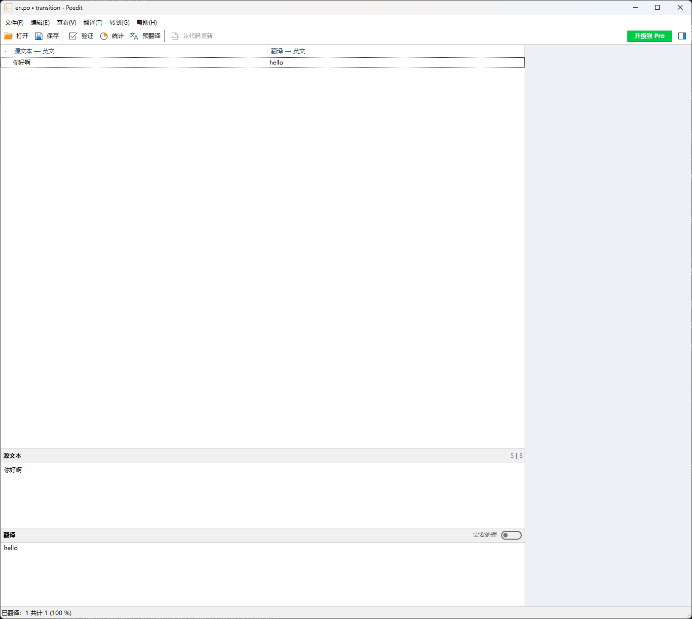

# POT本地化多语言支持

## 简介

要使用`gd-excelexporter`的多语言你首先要理解Godot的多语言方案。

Godot支持两种本地化多语言方案
- 翻译表（.translation）基于csv键值对的那种传统多语言表 -- [使游戏国际化](https://docsgodotengine.org/zh-cn/4.x/tutorials/i18n/internationalizing_games.html#)
- POT文件（.pot）基于gettext的POT文件。 --[使用gettext进行本地化](https://docs.godotengine.orgzh-cn/4.x/tutorials/i18n/localization_using_gettext.html#advantages)
前者是先在多语言表录入`key`和`文本`，然后代码中用`tr()`读取。也就是说是需要先录入，再使用。
后者是相反的，是先在代码中使用，通过`babel`之类的工具抽取到POT语言表中。

POT比传统多语言表有以下优势：
1. 研发期间不需要先添加翻译key，直接代码中正常开发即可，用`tr()`将需要翻译的字符串包起来。
2. Godot会自动抽取场景、tres等文件中文本字段到POT。
3. 自动除重，相同的字符串会合并成一条翻译。
4. 差异更新，不用像语言表那样手动管理增删。
5. 翻译工具更先进完备，`Poedit`编辑器或者`Transifex`（收费） 和 `Weblate`（Godot自己的多语言也是用这个，开源可以自己部署）等翻译平台来进行本地化翻译，然后导出`.po`文件。

Godot内置的POT功能可以将项目所有资源文件，比如场景（.tscn）、资源（.tres）中的一些字段（写死Godot里的）、还有`GDScript`里用`tr()`方法包裹的字符串都抽取到一个POT文件中用于本地化翻译。

而`gd-excelexporter`是使用第二种方案来将配置表中需要多语言支持的字符串抽取导出成POT文件的。

但是Godot无法抽取`excel`配置表文件。因此`excel`配置表中的字符串需要用`ee extract`命令来导出到`lang\template.pot`中。

## 使用Poedit来翻译POT

`Poedit`是一个跨平台的翻译工具，支持多种语言。
这是最简单的使用POT文件做多语言的方案。

### 安装

[下载地址](https://poedit.net/download)

### 导出PO文件
打开项目中的POT文件然后添加不同语言的翻译

翻译编辑完+保存成PO文件即可。

### 导入PO文件
将PO文件添加到Godot本地化的翻译分页里面即可

## Poedit工作流
敬请期待...

## Weblate工作流
敬请期待...